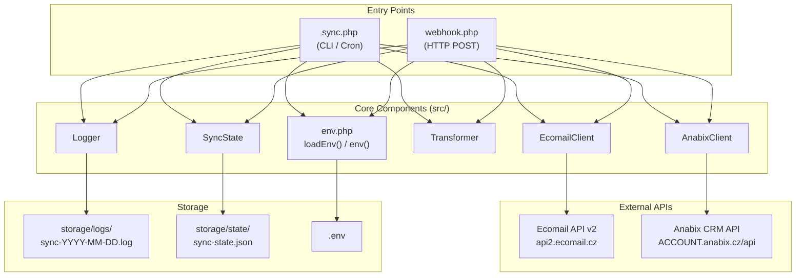
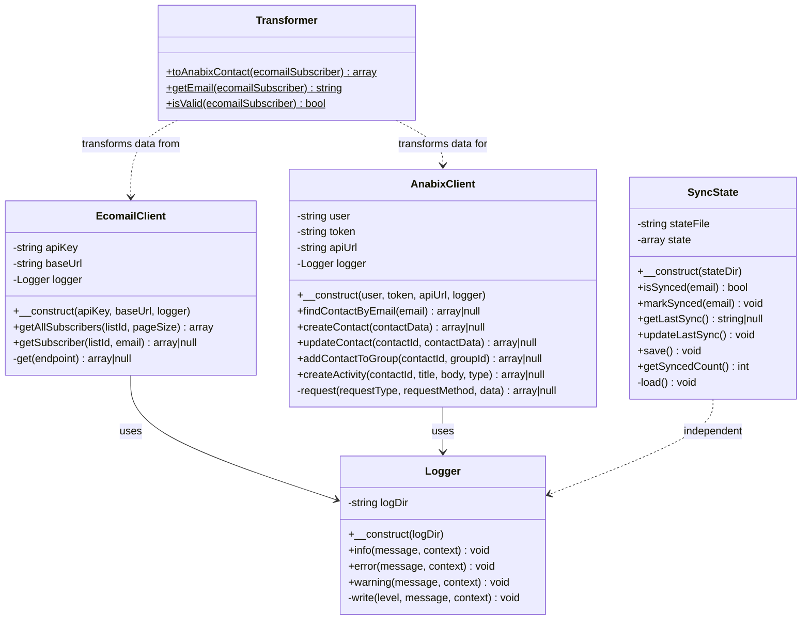
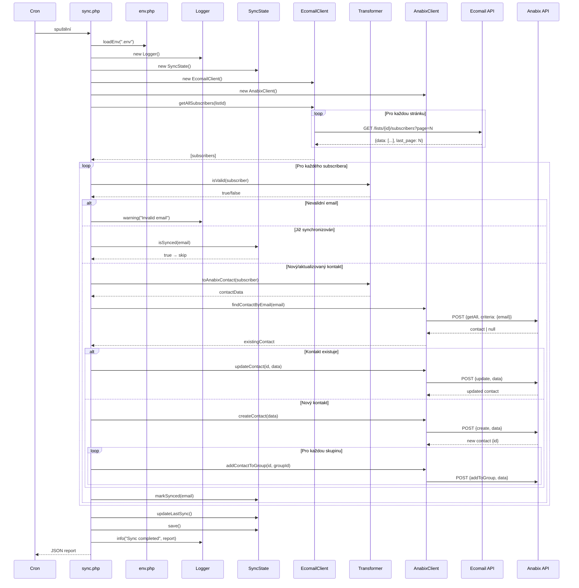
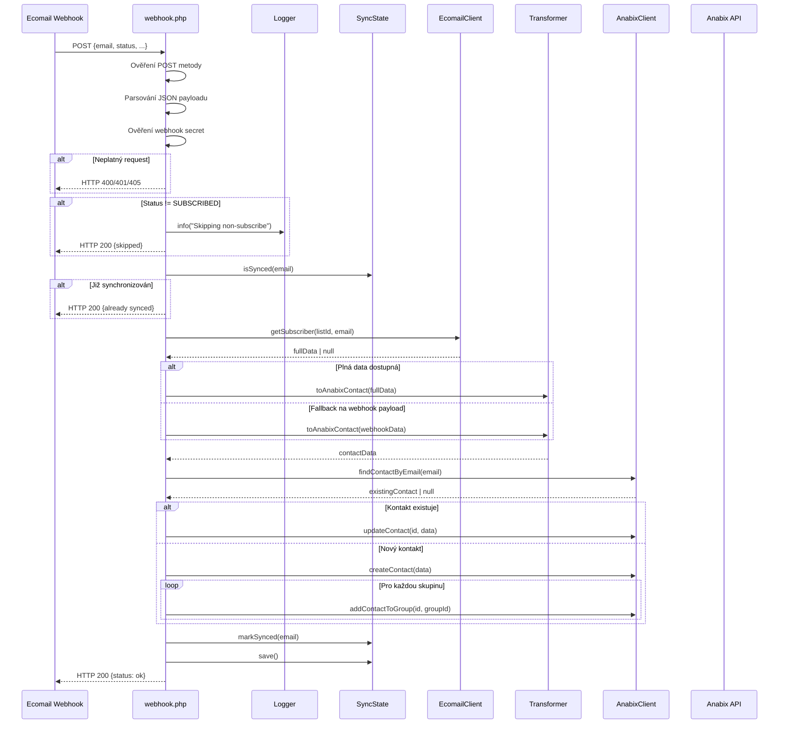
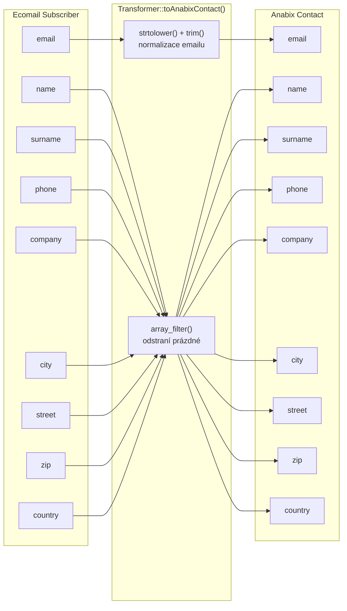
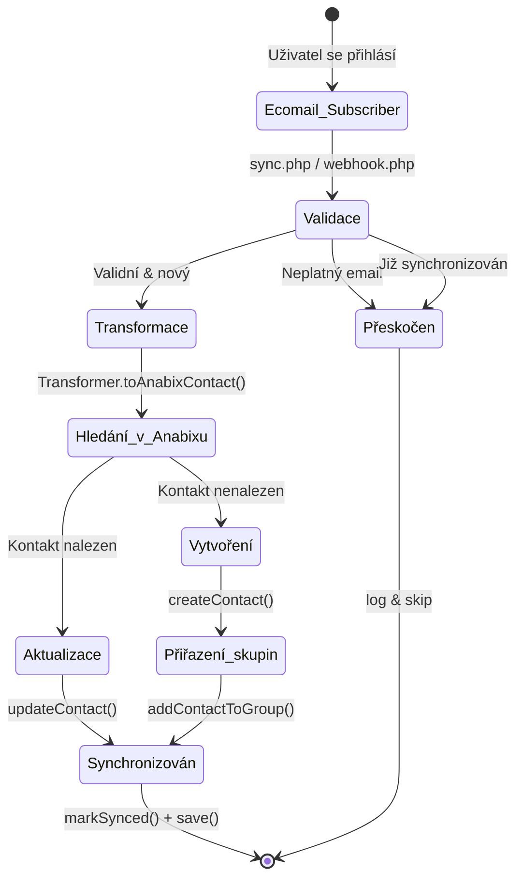
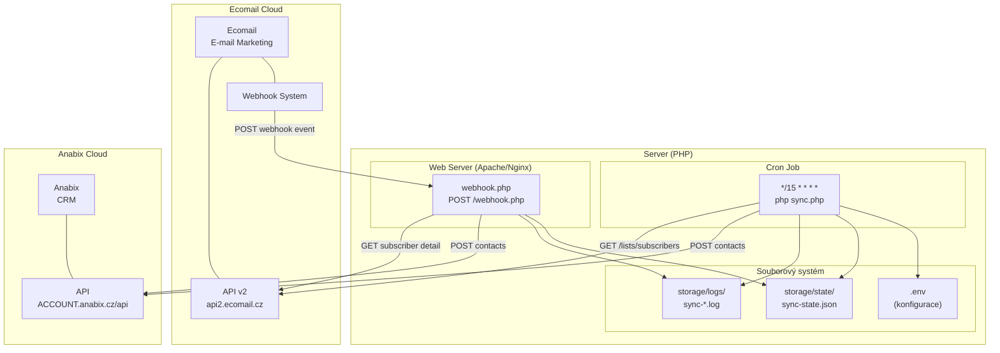

# Architektura aplikace sync-ecomail-to-anabix

## Popis aplikace

Aplikace synchronizuje kontakty z e-mailové marketingové platformy **Ecomail** do CRM systému **Anabix**. Podporuje dva režimy:

1. **Polling (sync.php)** - periodické stahování všech subscriberů z Ecomailu (cron)
2. **Webhook (webhook.php)** - real-time zpracování nových přihlášení z Ecomailu

Klíčové vlastnosti:
- **Delta sync** - sledování již synchronizovaných kontaktů (prevence duplikátů)
- **Upsert logika** - vytvoření nového nebo aktualizace existujícího kontaktu
- **Zařazení do skupin** - automatické přiřazení kontaktů do konfigurovaných skupin v Anabixu
- **Logování** - denní log soubory s kompletním auditním záznamem

---

## 1. Diagram komponent (Component Diagram)

---

## 2. Diagram tříd (Class Diagram)

---

## 3. Sekvenční diagram - Polling sync (sync.php)

---

## 4. Sekvenční diagram - Webhook (webhook.php)

---

## 5. Datový tok - Transformace (Data Mapping)

---

## 6. Stavový diagram - Životní cyklus kontaktu

---

## 7. Diagram nasazení (Deployment)

---

## 8. Souhrn architektury

| Vrstva | Komponenty | Odpovědnost |
|--------|-----------|-------------|
| **Entry Points** | `sync.php`, `webhook.php` | Orchestrace synchronizace |
| **API Clients** | `EcomailClient`, `AnabixClient` | Komunikace s externími API |
| **Business Logic** | `Transformer` | Mapování dat mezi systémy |
| **Persistence** | `SyncState` | Delta sync, prevence duplikátů |
| **Infrastructure** | `Logger`, `env.php` | Logování, konfigurace |
| **Storage** | `storage/logs/`, `storage/state/` | Soubory stavu a logů |
| **External** | Ecomail API v2, Anabix API | Zdrojový a cílový systém |

### Technologie
- **Jazyk:** PHP (bez frameworku)
- **HTTP klient:** cURL
- **Konfigurace:** `.env` soubor (vlastní parser)
- **Persistence:** JSON soubory (file-based)
- **Scheduling:** Cron (polling) + Ecomail Webhooks (real-time)
